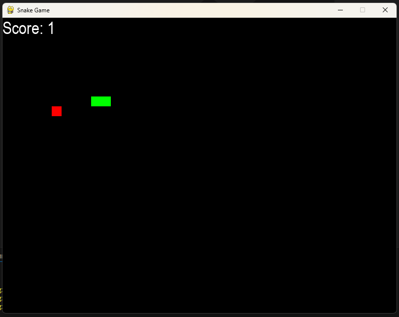

# Snake Game

This repository contains a classic Snake Game implemented using Python and Pygame. It is a simple yet fun project that recreates the nostalgia of the retro arcade game. 

## Features
- A colorful and responsive interface.
- Snake grows as it consumes food.
- Tracks score in real-time.
- Game over menu with options to restart or quit.
- Smooth and intuitive gameplay using arrow keys.

## What I Learned

During the development of this project, I gained valuable insights into the following:

1. **Game Development Basics:**
   - Designing a functional game loop.
   - Handling real-time events and user inputs.
   - Rendering graphics dynamically on the screen.

2. **Using Pygame Library:**
   - Drawing shapes and text on the screen.
   - Managing game objects such as the snake and food.
   - Handling collisions and boundary conditions.

3. **Problem-Solving:**
   - Implementing logical conditions for the snake's movement and growth.
   - Managing edge cases like self-collision and wall collision.

4. **Project Structure and Code Organization:**
   - Structuring the game code to make it readable and maintainable.
   - Using functions effectively to modularize the code.

## Future Improvements
- Add difficulty levels that increase the speed of the snake.
- Include power-ups or obstacles to make the gameplay more challenging.
- Add a high-score tracking feature.


## How to Run

1. **Clone this repository:**
   ```bash
   git clone https://github.com/Swyampatel/SnakeGame.git
   ```
2. **Navigate to the project directory:**
   ```bash
   cd SnakeGame
   ```
3. **Install dependencies:**
   Make sure you have Python installed. Install the required packages using:
   ```bash
   pip install -r requirements.txt
   ```
4. **Run the game:**
   ```bash
   python snake_game.py
   ```

## Controls
- **Arrow Keys**: Move the snake (Up, Down, Left, Right).
- **C**: Play again after game over.
- **Q**: Quit the game.

## Screenshots


This screenshot showcases the game interface and gameplay in action.

## Acknowledgments
This project was developed as a fun way to learn and improve Python programming and game development skills. Special thanks to the open-source community for the amazing Pygame library.


